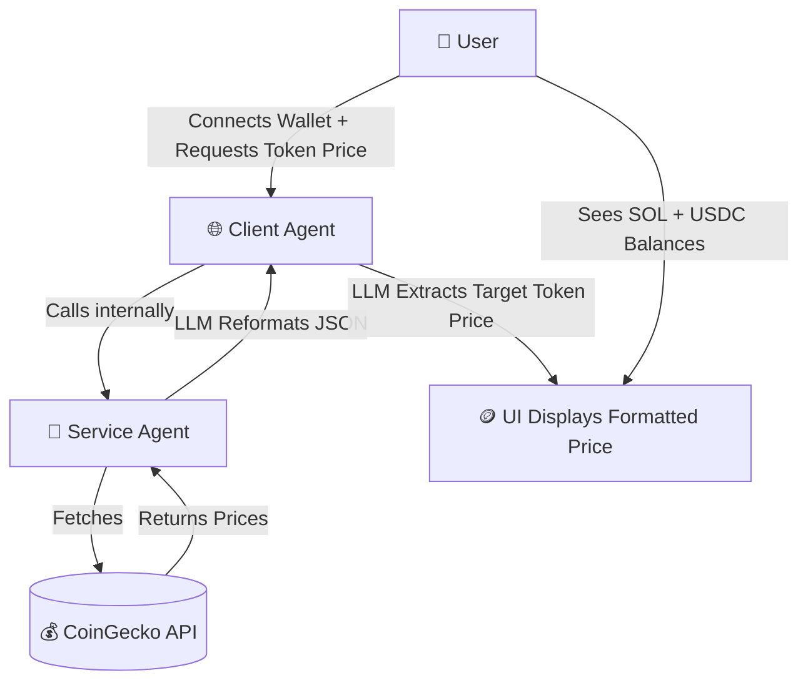
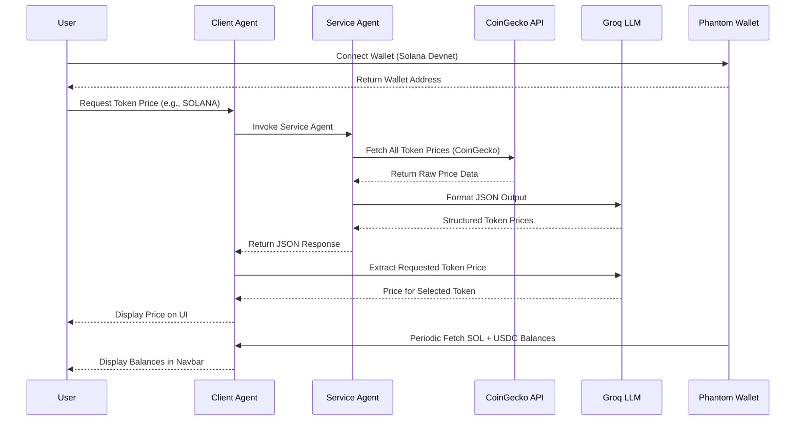

# 🪙 CryptoPricePro

## Live Demo: https://crypto-price-pro.vercel.app/

## Demo
<video width="600" controls>
  <source src="./demo/demo.mp4" type="video/mp4">
  Your browser does not support the video tag.
</video>

**CryptoPricePro** is a next-generation **Solana-based AI-powered dApp** that allows users to pay with **USDC on Solana** and fetch **real-time crypto token prices** using a **multi-agent architecture** powered by **LLMs (Groq + OpenAI GPT OSS models)**.

It integrates **Phantom wallet**, dynamically fetches **SOL and USDC balances**, and presents a beautifully designed, professional, and responsive UI.

---

## 🚀 Features

### 💡 Core Functionalities
- **🤖 LLM-driven Multi-Agent System**
  - **Service Agent** → Fetches token prices from CoinGecko API and uses LLM to format structured JSON responses.
  - **Client Agent** → Calls Service Agent internally (not via public API), uses LLM to parse and extract the specific token price requested by the user.
- **🔐 Phantom Wallet Integration**
  - Secure wallet connection on Solana **Devnet**.
  - Real-time balance display for **SOL** and **USDC**.
- **⚡ Dynamic Price Fetching**
  - Real-time token prices fetched via **Groq LLM** (`openai/gpt-oss-20b`).
  - LLM reformats and interprets raw API data for structured client use.
- **🎨 Modern Professional UI**
  - Elegant navbar with wallet info, tooltip-based address copy, and also with balance display in dashboard.
  - Animated transitions, responsive layout, and smooth gradient backgrounds.
- **🔄 Auto-Refreshing Balances**
  - SOL and USDC balances automatically refresh every few seconds.

---

## 🧠 Architecture Overview

### 🧩 System Overview
| Component            | Role                                                               | Technology              |
| -------------------- | ------------------------------------------------------------------ | ----------------------- |
| **Service Agent**    | Fetches data from CoinGecko and reformats it using LLM             | Groq API + CoinGecko    |
| **Client Agent**     | Calls Service Agent and extracts specific token prices using LLM   | Groq API + GPT OSS      |
| **Frontend**         | dApp interface for wallet connection, token selection, and display | Next.js + TypeScript    |
| **Blockchain Layer** | Handles wallet connection and token balances                       | Solana Devnet + Phantom |

---

### ⚙️ Architecture Flow Diagram



---

### 🔄 Component Interaction Diagram



---

## 📁 Project Structure

```
crypto-price-pro/
├── app/
│   ├── api/
│   │   ├── client-agent/route.ts             # Handles client agent requests via LLM
│   │   ├── service-agent/serviceAgent.ts     # Fetches and reformats CoinGecko data using LLM
│   ├── page.tsx                              # Main UI (Phantom wallet + token prices + balances)
│   └── layout.tsx                            # Global app layout
│
├── lib/
│   └── faremeter-client.ts            # FareMeter client for pay-per-call integration
│
├── types/
│   └── constant.ts                    # Token constants (BTC, ETH, SOL, etc.)
│   └── phantom.d.ts                   # Phantom wallet interface
│
├── .env.example                       # Example environment configuration file
├── package.json
├── tsconfig.json
└── README.md
```

---

## ⚙️ Technologies Used

| Category           | Stack                                      |
| ------------------ | ------------------------------------------ |
| **Frontend**       | Next.js (App Router) + React + TypeScript  |
| **Blockchain**     | Solana Web3.js + Phantom Wallet            |
| **AI Layer**       | Groq API (`openai/gpt-oss-20b`)            |
| **Backend Agents** | Next.js API Routes (Edge runtime)          |
| **Styling**        | Tailwind-like modern gradients and shadows |
| **External API**   | CoinGecko for crypto price data            |

---

## 🧰 Setup Instructions

### 1️⃣ Clone the Repository
```bash
git clone https://github.com/akhilkumarpilli/crypto-price-pro.git
cd crypto-price-pro
```

### 2️⃣ Install Dependencies
```bash
npm install
```

### 3️⃣ Environment Configuration
A sample environment file is provided as `.env.example`.  
To configure your environment:

```bash
cp .env.example .env
```

Now open `.env` and fill all the required variables.


### 4️⃣ Run in Development Mode
Ensure your **Phantom Wallet** is set to **Solana Devnet**, then start the app:

```bash
npm run dev
```

Now open your browser at:
👉 [http://localhost:3000](http://localhost:3000)

---

## 🪙 Supported Tokens
You can modify supported tokens in `types/constant.ts`:

```ts
export const AVAILABLE_TOKENS = ["cosmos", "osmosis", "solana", "ethereum", "binancecoin", "sui", "bitcoin"];
```

These are the tokens that can be fetched by the Service Agent from CoinGecko.

---

## 🧩 How It Works (Step-by-Step)

1. User connects their Phantom wallet on **Solana Devnet**.
2. The UI displays **SOL** and **USDC** balances (auto-refreshing).
3. The user selects a token (e.g., SOLANA) from a dropdown.
4. When “💰 Get Price (USDC Payment)” is clicked:
   - The **Service Agent** fetches all token prices from CoinGecko.
   - The **Client Agent** internally calls the **Service Agent**.
   - The **Groq LLM** reformats the response into structured JSON.
   - The **Client Agent’s LLM** parses the formatted response to extract **only the requested token’s price**.
   - The UI displays the final formatted token price.

---

## 🪄 Example User Flow

| Step                 | Description                                                                 |
| -------------------- | --------------------------------------------------------------------------- |
| 🧩 **Connect Wallet** | User connects Phantom Wallet (Devnet). Address and balances show in navbar. |
| 💰 **Select Token**   | User selects a token (SOL, BTC, ETH, etc.) from dropdown.                   |
| ⚡ **Fetch Price**    | Calls Client Agent → Service Agent → CoinGecko → LLM formatting.            |
| 📋 **Copy Address**   | Click copy icon beside wallet address to copy it (tooltip “Copied!” shown). |

---

## 🧠 Error Handling

- Balance fetch errors (e.g., missing token accounts) are logged in console but **not shown** in UI.
- Token fetch or payment errors are gracefully shown in the main card.
- LLM parsing errors are caught and displayed with context.

---

## 🧱 Future Enhancements

- 🗣 Natural language queries (e.g., “What’s the price of ETH today?”)
- 💵 Full Solana Pay integration for paid API calls
- 📊 Token charts and historical analytics
- 🔗 On-chain registry for allowed tokens
- 🌍 Multi-network (Mainnet, Devnet) selector

---

## 🪶 License

This project is licensed under the **Apache License 2.0** — free for personal and commercial use.

---

## 🧩 In Summary
**CryptoPricePro** combines:
- Solana blockchain integration 🪙  
- Multi-agent LLM system 🤖  
- Real-time CoinGecko data 🌐  
- Modern and elegant UI 🎨  

It’s a **complete AI + Blockchain fusion project**, showcasing how LLMs can automate structured data parsing and reasoning for Web3 applications.

---
